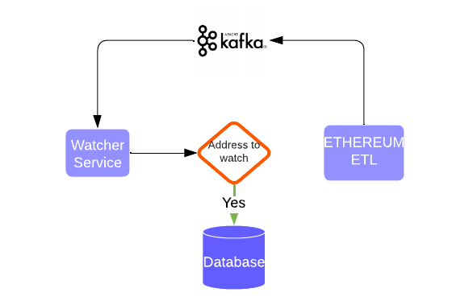

# Blockchain Watcher
Listening on-chain transactions for mentioned wallet addresses.

## Instruction

To start the service, you can run:

### `docker-compose up `

## Architecture for the same will be

## Current Service is build using 
### 1. Nodejs
### 2. MySql
### 3. Etherjs